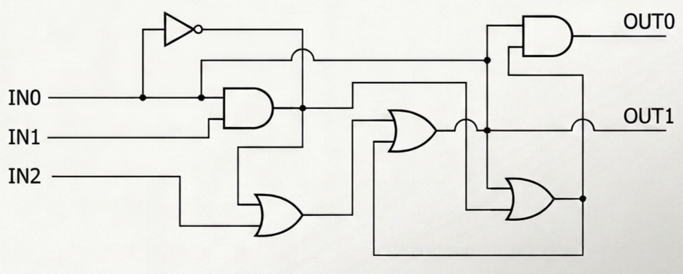
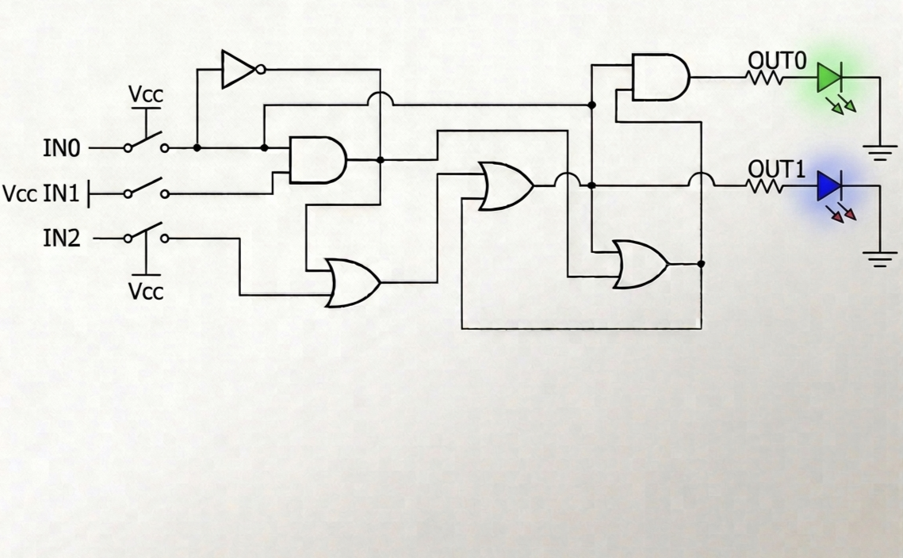

<!---

This file is used to generate your project datasheet. Please fill in the information below and delete any unused
sections.

You can also include images in this folder and reference them in the markdown. Each image must be less than
512 kb in size, and the combined size of all images must be less than 1 MB.
-->

## How it works

This project is a Universal Bypass Manager with Hysteresis a microchip designed to protect chemical health and extend the lifespan of lithium batteries in portable devices such as smartphones and laptops In place of keeping a battery constantly charging at 100% which degrades it through heat and voltage stress this chip isolates the battery once it reaches an optimal level and powers the device directly from the charger via Bypass The internal logic utilizes a mixed architecture featuring a Combinational Stage that monitors three inputs comprising charger presence IN0 the upper battery limit IN1 $\geq$ 80% and the lower limit IN2 $\leq$ 75% as well as a Sequential Stage or Memory that employs an SR Latch constructed with cross-coupled NOR gates This introduces hysteresis into the system so if the battery naturally drops from 80% to 79% the SR Latch remembers to keep the Bypass active and refuses to inject a charge until the battery falls below the safe limit of 75% which effectively prevents rapid oscillations and harmful charging micro-cycles

## How to test

To test this design on the physical demonstration board or in simulation use the input switches and observe the output LEDs with the following Pin Configuration where IN0 Switch 1 simulates connecting the charger 1 equals connected 0 equals disconnected while IN1 Switch 2 represents the upper limit sensor 1 equals battery reached 80% and IN2 Switch 3 represents the lower limit sensor 1 equals battery dropped to 75% alongside OUT0 Green LED for the Charge command which closes the circuit to the battery and OUT1 Blue LED for the Bypass command which isolates the battery and routes power to the main board To perform the hysteresis test follow these steps starting with Power On by activating IN0 Charger ON and IN2 Bat $\le$ 75% which should turn on OUT0 Green then move to Rising Charge by turning off IN2 simulating 78% where OUT0 Green must stay on due to the memory state followed by the Goal Bypass phase by activating IN1 Bat $\ge$ 80% causing OUT0 to turn off and OUT1 Blue to turn on and finally the key Hysteresis Test by turning off IN1 simulating a drop to 79% where OUT1 Blue must remain on as the system refuses to charge for a 1% loss until the Cycle Reset occurs by activating IN2 again to restart the process and turn OUT0 back on

## External hardware

Since this ASIC chip serves as the low-power logic brain operating at 3.3V and handling logic-level currents it requires external sensors to read data and power hardware to execute actions so to implement this chip in a real circuit one must include a Detection Module acting as the senses such as a basic microcontroller like an ESP32 with Bluetooth to read the device battery status via software and send 3.3V pulses to pins IN1 and IN2 or alternatively in purely analog systems Voltage Comparators like the LM393 connected directly to the lithium cells alongside a Power Stage acting as the muscles which utilizes power MOSFET transistors such as P-Channel MOSFETs or Solid State Relays connected to OUT0 and OUT1 to serve as high-capacity electrical valves that open and close the current flow ranging from 5V to 20V from the USB-C port to the mobile device

